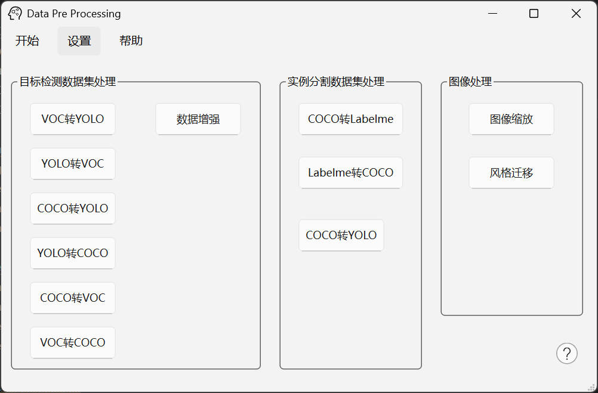

#  深度学习数据集预处理软件系统

## 1. 目标检测数据集处理
- [VOC 转 YOLO (VOC2YOLO)](docs/VOC2YOLO.md) 
- [YOLO 转 VOC (YOLO2VOC)](docs/YOLO2VOC.md) 
- [COCO 转 YOLO (COCO2YOLO_bbox)](docs/COCO2YOLO.md) 
- [YOLO 转 COCO (YOLO2COCO)](docs/YOLO2COCO.md)
- [VOC 转 COCO (VOC2COCO)](docs/VOC2COCO.md)
- [COCO 转 VOC (COCO2VOC)](docs/COCO2VOC.md)

## 2. 实例分割数据集处理
- [COCO 转 LabelMe (COCO2Labelme)](docs/COCO2Labelme.md)
- [COCO 转 YOLO (COCO2YOLO_instance)](docs/COCO2YOLO_instance_seg.md)
- [LabelMe 转 COCO (Labelme2COCO)](docs/Labelme2COCO.md)

## 3. 图像预处理
- [风格迁移 (Image_style_transfer)](docs/Image_style_transfer.md)
- [图像缩放 (Image_size)](docs/Image_size.md)

####
#### 深度学习数据集预处理软件系统

