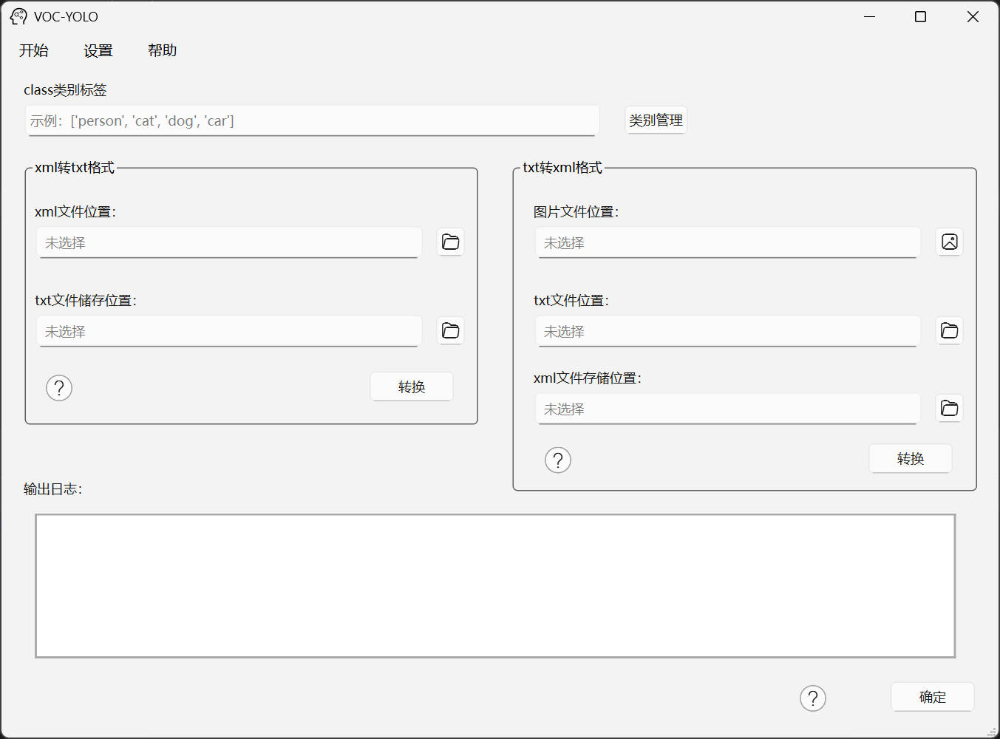

#  VOC 转 YOLO (VOC2YOLO)

### 步骤
在xml转txt格式功能中：
1. 类别写入
2. 选择xml文件位置
3. 选择txt文件位置
4. 开始转换

+ [查看类别写入方式](classes_manage.md)

####
#### VOC 转 YOLO


#### VOC格式示例
````
<annotation>
  <!-- 数据集名称/文件夹 -->
  <folder>VOC2007</folder>
  <!-- 原始图像文件名 -->
  <filename>000001.jpg</filename>
  <size>
    <!-- 图像宽度（像素） -->
    <width>486</width>
    <!-- 图像高度（像素） -->
    <height>500</height>
    <!-- 图像通道数-->
    <depth>3</depth>
  </size>
  <object>
    <!-- 目标类别名称 -->
    <name>dog</name>
    <bndbox>
      <!-- 边界框左上角x坐标 -->
      <xmin>48</xmin>
      <!-- 边界框左上角y坐标 -->
      <ymin>240</ymin>
      <!-- 边界框右下角x坐标 -->
      <xmax>195</xmax>
      <!-- 边界框右下角y坐标 -->
      <ymax>371</ymax>
    </bndbox>
  </object>
</annotation>
````

#### YOLO格式示例
````
<class_id> <x_center> <y_center> <width> <height>

e.g. 
0 0.4923095703125 0.37613932291666663 0.092041015625 0.19108072916666666
````